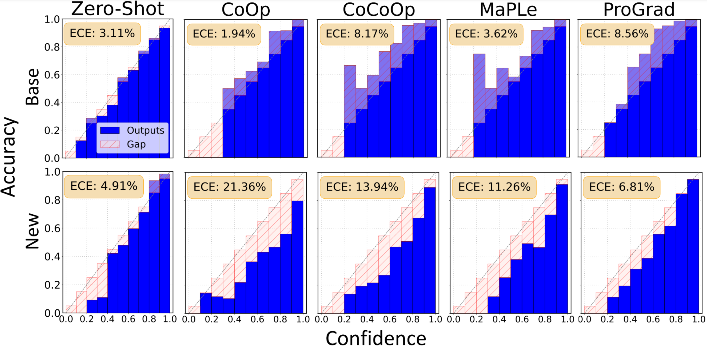

# Open-Vocabulary Calibration for Fine-tuned CLIP


This is the official implementation for  [Open-Vocabulary Calibration for Fine-tuned CLIP 🔗](https://arxiv.org/abs/2402.04655) at ICML 2024.

## Abstract
Vision-language models (e.g, CLIP) have emerged as formidable tools, showing their strong capability in handling various open-vocabulary tasks in image recognition, text-driven visual content generation, and visual chatbots, to name a few. In recent years, considerable efforts and resources have been devoted to adaptation methods for improving the downstream performance of VLMs, particularly on parameter-efficient fine-tuning methods like prompt learning. However, a crucial aspect that has been largely overlooked is the confidence calibration problem in fine-tuned VLMs, which could greatly reduce reliability when deploying such models in the real world. This paper bridges the gap by systematically investigating the confidence calibration problem in the context of prompt learning and reveals that existing calibration methods are insufficient to address the problem, especially in the open-vocabulary setting. To solve the problem, we present a simple and effective approach called Distance-Aware Calibration (DAC), which is based on scaling the temperature using as guidance the distance between predicted text labels and base classes. The experiments with 7 distinct prompt learning methods applied across 11 diverse downstream datasets demonstrate the effectiveness of DAC, which achieves high efficacy without sacrificing the inference speed.




## Setup

**1. Installation** 

For installation and other package requirements, please follow the instructions detailed in [INSTALL.md](docs/INSTALL.md).

**2. Data preparation**

Please follow the instructions at [DATASETS.md](docs/DATASETS.md) to prepare all datasets.

<!-- **3. Checkpoints**

For CLIP models, our reported results are based on [checkpoints](clip/clip.py) provided OpenAI. For our main results in Table 2, the checkpoint is available [here](https://arxiv.org/abs/2109.01134).
 -->


## Quick Start

Please refer to ``./run`` for more info about our scripts. 

**1. Tuning & Evaluation** 

```bash
GPU_ID=1 # replace it with your GPU ID
bash run/classfication/zeroshot.sh ${GPU_ID} # zero-shot CLIP
bash run/classfication/fewshot.sh ${GPU_ID} # fine-tuned CLIP
```


**2. Calibration (reproduce our results)** 

```bash
GPU_ID=1
bash run/calibration/fewshot_scaling.sh ${GPU_ID} # DAC on fine-tuned CLIP
```

The results will be logged in ``output/base2new/logs_base2new.csv``. 
<!-- Furthermore, we provide a guideline in [RUN.md](docs/RUN.md) for detailed instructions about our repo. -->


## :ballot_box_with_check: Supported Methods

**1. Tuning** 

We mainly use parameter-efficient fine-tuning methods like prompt learning in our experiments.

| Method                    | Paper                                         |                             Configs                             |          Code         |
|---------------------------|:----------------------------------------------|:---------------------------------------------------------------:|:----------------------------------:|
| CoOp                      | [IJCV'22](https://arxiv.org/abs/2109.01134) |           [link](configs/trainers/CoOp)                  |        [link](trainers/classification/coop.py)        |
| Co-CoOp                   | [CVPR'22](https://arxiv.org/abs/2203.05557) |            [link](configs/trainers/CoCoOp)                 |       [link](trainers/classification/cocoop.py)       |
| ProDA                   | [CVPR' 20'22](https://arxiv.org/abs/2205.03340) |            [link](configs/trainers/ProDA)                 |       [link](trainers/classification/kgcoop.py)       |
| KgCoOp                     | [CVPR 2023](https://arxiv.org/abs/2303.13283)            | [link](configs/trainers/KgCoOp)  | [link](trainers/classification/maple.py)    |
| MaPLe                     | [CVPR'23](https://arxiv.org/abs/2210.03117)            | [link](configs/trainers/MaPLe/vit_b16_c2_ep5_batch4.yaml)  | [link](trainers/classification/maple.py)    |
| ProGrad                   | [ICCV'23](https://arxiv.org/abs/2205.14865) |            [link](configs/trainers/ProGrad)                 |       [link](trainers/classification/prograd.py)       |
| PromptSRC                     | [ICCV'23](https://arxiv.org/abs/2307.06948)            | [link](configs/trainers/PromptSRC)  | [link](trainers/classification/promptsrc.py)    |

<hr />


**2. Calibration** 


| type |       Method              | Paper                                         |                             Configs                             |          Code         |
|----------- |---------------------------|:----------------------------------------------|:---------------------------------------------------------------:|:----------------------------------:|
|Scaling |  Temperature Scaling       | [ICML'17](https://arxiv.org/abs/1706.04599) |           [link](configs/calibration/TempScaling)                  |        [link](trainers/calibration/tempscaling.py)        |
| | Density-Ratio Calibration                   | [NeurIPS'24](https://arxiv.org/abs/2306.04590) |            -                 |       [link](trainers/calibration/density_ratio_calibration.py)       |
| Bin |  Histogram Binning                   | [ICML'01 ](https://dl.acm.org/doi/10.5555/645530.655658) |            -                 |       -
|  |  Isotonic Regression                   | [KDD'02](https://dl.acm.org/doi/10.1145/775047.775151) |            -                 |       -      
|  |  Multi-Isotonic Regression                   | [ICML'20](https://arxiv.org/abs/2003.07329) |            -                 |       [link](trainers/calibration/multi_isotonic_regression.py)    

<hr />

<!-- ## Results -->


## Citation

If you find this useful in your research, please consider citing:
```
@inproceedings{wang2024open,
  title={ Open-Vocabulary Calibration for Fine-tuned CLIP},
  author={Wang, Shuoyuan and Wang, Jindong and Wang, Guoqing and Zhang, Bob and Zhou, Kaiyang and Wei, Hongxin},
  booktitle = {International Conference on Machine Learning (ICML)},
  year = {2024}
}
```

## Acknowledgements

Our code is inspired by [CoOp](https://github.com/KaiyangZhou/CoOp) and [MaPLe](https://github.com/muzairkhattak/multimodal-prompt-learning). We thank the authors for releasing their code.